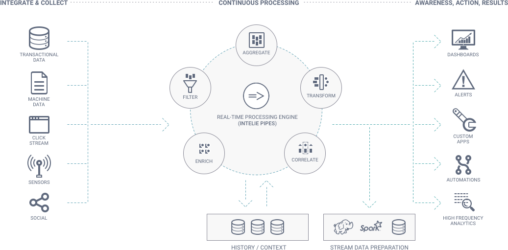

# Introduction

INTELIE Live is a real-time stream analytics platform that enables the visualization and monitoring of high volumes of data.

INTELIE Live platform heavily relies on [INTELIE Pipes](https://pipes.intelie.com) engine.
