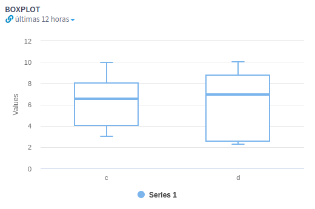

# Boxplot

In descriptive statistics, a boxplot is a convenient way of graphically depicting groups of numerical data through their quartiles. A boxplot  gives a nice summary of one or several numeric variables. The line that divides the box into 2 parts represents the median of the data. The end of the box shows the upper and lower quartiles. The extreme lines show the highest and lowest value. Boxplots can be drawn either horizontally or vertically.&#x20;


This functionality is provided by the **live-exploratory-viz-1.2.0+** plugin. It is available on the [marketplace](https://marketplace.intelie.com/artifact/plugin-live-exploratory-viz/).


Is this plugin, there is an aggregation function for generate a boxplot: `boxplot(value)`, where the input is any numeric value output from a Pipes query.&#x20;

\
Example:

```
=>random() as r every 5 seconds 
=>boxplot(r) over last 5 minutes every 5 seconds
```

The boxplot function returns an array with the following structure:\
&#x20;       1\. Minimum\
&#x20;       2\. First quartile\
&#x20;       3\. Second quartile (Median)\
&#x20;       4\. Third quartile\
&#x20;       5\. Maximum \
&#x20;       6\. Mean

Example (return values will change according to the input):&#x20;

<pre><code><strong>BOXPLOT_R:
</strong>[
  0.004594705151877432,
  0.22249999999999998,
  0.4125,
  0.693,
  0.9996315781971197,
  0.4466841663899076
]
</code></pre>

#### Functional Tutorial

Using the pipes query below as an example:

```
=> every 5 minutes 
=> @set (timestamp#spantest("from 00:00 to 11:59:59"))==0 ? 'c', 'd' as crew 
=> @set crew == 'c' ? random(10, 2), random(10, 2) as s2s 
=> @filter s2s#>0 => @set count():overall as count 
=> boxplot(s2s) by crew over all
```

We can obtain a chart similar to this one:

<figure><figcaption><p>Boxplot Example</p></figcaption></figure>
