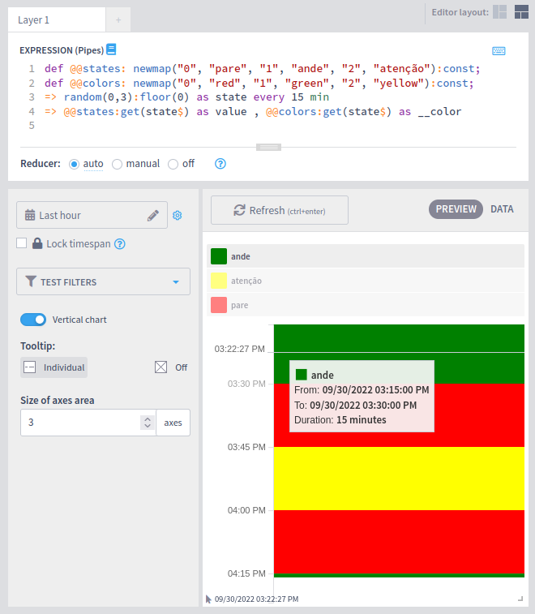

# State Timeline

A state timeline is a way of representing events that occurs over time.

Each state will be rendered as a bar starting at the event timestamp. The bar will end just before the start of the next state or at the present time if there is no next state.

The `value` of the state must be a string and will be showed in the legend and the tooltip.

The color of the bar must be set using `__color`.


This functionality is provided by the **live-exploratory-viz** plugin. It is available on the [marketplace](https://marketplace.intelie.com/artifact/plugin-live-exploratory-viz/).


The chart settings allow you to choose its orientation, whether or not to display a tooltip when hovering the mouse over the states and the space available for the legend.

#### Example of use

Using the pipes query below as an example:

```
def @@states: newmap("0", "pare", "1", "ande", "2", "atenção"):const;
def @@colors: newmap("0", "red", "1", "green", "2", "yellow"):const;
=> random(0,3):floor(0) as state every 15 min
=> @@states:get(state$) as value, @@colors:get(state$) as __color
```

We can obtain a chart similar to this one:

<figure><figcaption></figcaption></figure>
