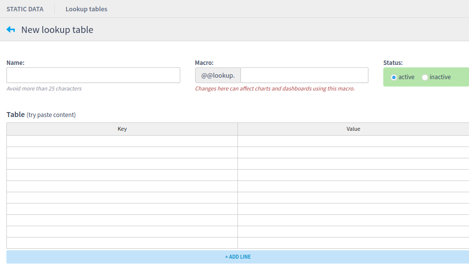

# Lookup Tables

A Lookup Table represents a table with two columns: key and vale. It is used to map values that represents Lookups and Assets. So, they provide a way to filter Lookups and Assets.

Lookup Tables can be created inside the code, by creating a new instance of `LookupTable.class` or using Live's interface.



## Permissions

Sometimes, developers may need to implement different forms of permissions to ensure correct filters. To do so, Live provides an extendable `LookupTable` which allows your own solution.

```java
public class LookupTable {
    private final String key;
    private final String name;
    private final Lookup lookup;
    private final String source;
    private final String sourceUrl;

    public LookupTable(String key, String name, Lookup lookup) {
        this(key, name, lookup, null, null);
    }

    protected LookupTable(String key, String name, Lookup lookup, String source, String sourceUrl) {
        this.sourceUrl = sourceUrl;
        Preconditions.checkNotNull(lookup, "lookup");
        this.key = key;
        this.name = name;
        this.lookup = lookup;
        this.source = source;
    }

    public LookupTable withSource(String source, String sourceUrl) {
        return new LookupTable(key, name, lookup, source, sourceUrl);
    }

    public String getKey() {
        return key;
    }

    public String getName() {
        return name;
    }

    public Lookup getLookup() {
        return lookup;
    }

    public String getSource() {
        return source;
    }

    public String getSourceUrl() {
        return sourceUrl;
    }

    public LookupTable getFilteredLookupTable(LoggedUser user) { return this; }
}

```

You just need to implement your own `LookupTable` and override the methods `withSource` and `getFilteredLookupTable`. The first one should return a new instance of the created class, and the second one should contain your implementation of permission.

```java
public class FilteredLookupTable extends LookupTable {

    public FilteredLookupTable(String key, String name, Lookup lookup) {
        super(key, name, lookup);
    }

    protected FilteredLookupTable(String key, String name, Lookup lookup, String source, String sourceUrl) {
        super(key, name, lookup, source, sourceUrl);
    }

    @Override
    public LookupTable withSource(String source, String sourceUrl) {
        return new FilteredLookupTable(this.getKey(), this.getName(), this.getLookup(), source, sourceUrl);
    }

    @Override
    public LookupTable getFilteredLookupTable(LoggedUser user) {
        if(this.getName().equals("test")) return this;
        else return withSource("sourceTest", "sourceUrl");
    }
}
```

Since the method `getFilteredLookupTable` is responsable to filter the `LookupTable`, you could use the `LoggedUser` passed by parameter or the `Lookup` which exists inside `LookupTable`.

## Permissions based on Assets

Liverig already have an abstract generic `LookupTable` to get values of `Assets`. So, if you need control the permission based on Asset's permissions and perspectives, then we already have two LookupTables to do it.



```java
public class AssetNameKeyLookupTable extends GenericLookupTablePermission {

    public AssetNameKeyLookupTable(String key, String name, Lookup lookup, AssetService assetService, AssetPerspectivePermission assetPerspectivePermission) {
        super(key, name, lookup, assetService, assetPerspectivePermission);
    }

    public AssetNameKeyLookupTable(GenericLookupTablePermission table, String source, String sourceUrl) {
        super(table, source, sourceUrl);
    }

    @Override
    public LookupTable withSource(String source, String sourceUrl) {
        return new AssetNameKeyLookupTable(this, source, sourceUrl);
    }

    @Override
    public LookupTable getFilteredLookupTable(LoggedUser user) {
        LookupPermission lookup = new LookupPermission(getAssets(user), this.getLookup()) {
            @Override
            public Object getKey(Entry entry) {
                return entry.getKey();
            }
        };
        return new AssetNameKeyLookupTable(this.getKey(), this.getName(), lookup, getAssetService(), getAssetPerspectivePermission());
    }
}
```



```java
public class EventNameKeyLookupTable extends GenericLookupTablePermission {
    public EventNameKeyLookupTable(String key, String name, Lookup lookup, AssetService assetService, AssetPerspectivePermission assetPerspectivePermission) {
        super(key, name, lookup, assetService, assetPerspectivePermission);
    }

    public EventNameKeyLookupTable(GenericLookupTablePermission table, String source, String sourceUrl) {
        super(table, source, sourceUrl);
    }

    @Override
    public LookupTable withSource(String source, String sourceUrl) {
        return new EventNameKeyLookupTable(this, source, sourceUrl);
    }

    @Override
    public LookupTable getFilteredLookupTable(LoggedUser user) {
        LookupPermission lookup = new LookupPermission(getAssets(user), this.getLookup()) {
            @Override
            public Object getKey(Entry entry) {
                return entry.getValue();
            }
        };
        return new EventNameKeyLookupTable(this.getKey(), this.getName(), lookup, getAssetService(), getAssetPerspectivePermission());
    }
}
```



The `AssetNameKeyLookupTable`should be used to LookupTables which use Asset's name as key. While `EventNameKeyLookupTable`should be used to LookupTables which use Event's type as key.

```java
engine.addLookupTable(new AssetNameKeyLookupTable("table-name", "Asset",
                lookup.nameToEventType(), assetService, assetPerspectivePermission));
engine.addLookupTable(new EventNameKeyLookupTable("table-name", "Event type",
                lookup.eventTypeToName(), assetService, assetPerspectivePermission));
```
