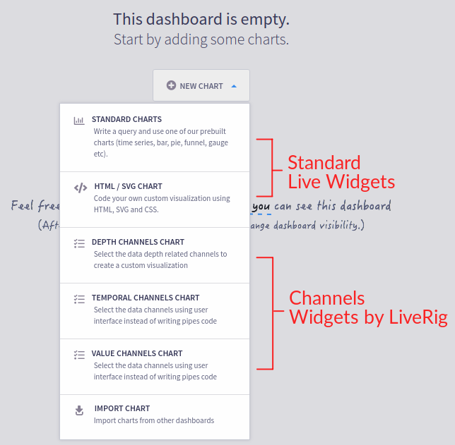

# Dashboard and Widgets

Live widely supports the concept of Dashboard and Widgets. A Dashboard organizes a set of charts instances which implementations are named a Live Widget.

.png>)

Live Widgets could be assume one of these kinds and could be mixed at the same Dashboard:

1. Pipes Widgets
2. HTML/SVG Widget
3. Channels Widgets (available only in LiveRig)

Live has many APIs to help developers to build their own Dashboards and Widgets. Many of them use D3JS and many other great tools to create stunning applications for Drilling and Industrial Solutions.

### Pipes Widgets

The very first and most common kind of Live Widgets are the Pipes Charts. The [Data Visualization](../../../data-visualization/pipes-widgets/) section shows some examples of built-in Pipes Widgets implementations in Live. They are available to use at side toolbar of the widget editor.

.png>)

### HTML/SVG Widgets

Actually it's a variant of Pipes Widgets since it also allows you define a Pipes Expression directly at Widget configuration time in order to processing events in storage providers or real-time collectors.

A easier way to create and test a new widget in Live Platform is creating a HTML/SVG Widget. The [JSX Widgets](../../../data-visualization/pipes-widgets/js-widgets.md) section explains how to generate a boilerplate code to start the coding of a new React Component.&#x20;

SVG elements are fully supported in modern browsers, so you got the power! You can just received new data from Live Event Processing engine and updates your SVG Element or React Component as needed.

### Channels Widgets

Channels Widgets provide an user and data-centric approaches for widget and dashboard configuration. The concept of [Channels in Drilling Solutions](https://drilling.intelie.com/features/data-visualization) provides new kind of widgets dedicated to:

* Temporal Channels
* Depth Channels&#x20;
* Value-based Channels

Using these concepts the Live Platform user don't have to write Pipes Expressions to create new Live Widgets (as needed in previous built-in widget types). The administrator and the dashboard manager could concentrate their attention to describe the assets to Live collect, normalize and make data available to data channels.

Channels Widgets no means without Pipes completely. It just means the Pipes Expressions (if they are used) should be built-in the widget implementation and the widget configuration could provide some way to parameterize pipes queries itself.

Live Marketplace has some applications that were created taking advantage of data channels: [https://marketplace.intelie.com/artifact/plugin-realtime-operations](https://marketplace.intelie.com/artifact/plugin-realtime-operations)
