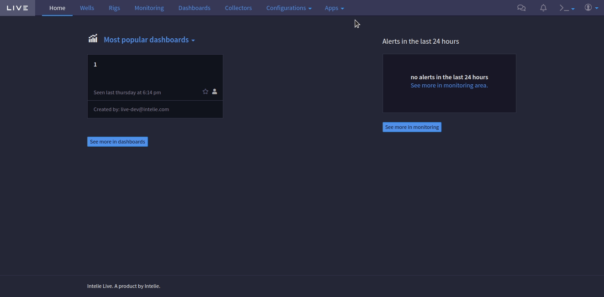

# Standard API


Since Live @ 2


# Menu service

The menuService is a javascript module that allows registering custom menu items to Live navigation bar or an item that already exists at the navigation bar. Every menu item must have a unique name and alias to represent itself.

# How to import

``` typescript
import MenuService from 'live/services/menu'
```

# Methods

> register(menu: MenuItem, type: MenuType): void

Register a new menu item.

> unregister(menu: MenuItem, type: MenuType): void

Unregister an already existing menu item.

> getAll(): MenuItems

Obtain all registered menu items.

> withMenuItems(Component: React.ComponentType<{ menus: MenuItems }>): React.FC

Allow a React component to receive all listed menus.

## Menu Item Base

The base properties that are commom between all types of menu are explained in more detail in the table below:

| Property | Required | Description |
| -------- | -------- | ----------- |
| `name` | Yes | Textual name of the menu that will be displayed in the navbar. |
| `alias` | Yes | Textual representation of the menu, used to apply the "selected" status to the option at the navbar. It must be the same alias of the registered route. |
| `url` | Yes | Route to access the menu component (it must be the same path registered previously by `live/services/router` or other compatible route API you want). Must respect the format `/#/${path}/`. |
| `Component` | No | Instead of a url route, you can use this property to render a component (like Configurations dropdown), but will need to style the menu item manually inside it. * It will not use the url if you don't use the `props.href` inside it. |
| `selectedAliases` | No | Array with all textual names the menu will have. If your registered route path and alias are different, you must put both in this array to apply the "selected" status when your menu option is selected. |
| `order` | No | Numeric representation of the order that the menu will appear (if not set, it will appear just before the `Configurations` menu). |
| `replaces` | No | Textual representation of an alias of another menu item you want to replace with the one you're creating. |
| `config.showOnMobile` | No | If set to false, it will not show the menu option when Live is in mobile mode. |
| `onClick` | No | Function that must be executed when clicking the menu item |

## Menu Right Item

The 'right' type menu has the `component` property instead of the `Component` described before. It also have the same properties, with an extra described as follows:

| Property | Required | Description |
| -------- | -------- | ----------- |
| `config.iconCls` | No | Icon you want to use to represent the new menu. It already has the `far` class applied (or `fal` if showOnMobile is `true`). |

## Menu Preferences Item

The preferences menu has some extra properties that are described down below:

| Property | Required | Description |
| -------- | -------- | ----------- |
| `description` | No | This text will appear right after the menu name in the dropdown menu, like the "Email, password, permissions" of "My account" menu. |
| `icon` | No | Icon that will represent your menu. It will be located aside the menu name and description. |

## Menu Console Item

The console menu has the same `component`, `name`, `url`, `onClick`, `icon` and `description` described above, but have its own particularities. See the table below to know about the extra properties of it:

| Property | Required | Description |
| -------- | -------- | ----------- |
| `config.iconCls` | No | Same behavior of the `icon` property. It's the class of the icon you want to appear. |
| `config.iconPath` | No | If you want to show a pre-defined image to act as your icon, you should use it as the path to find the it. |

# Examples

## Regular menu example:

```typescript
const Test = (): JSX.Element => <h1 style={{ padding: '50px 0 0 20px' }}>Test</h1>

Router.route('test', Test, 'test')

MenuService.register(
    {
        alias: 'test',
        name: 'Test Menu',
        url: '/#/test/'
    },
    'regular'
)
```


## Regular menu with selectedAliases:

```typescript
const Test = (): JSX.Element => <h1 style={{ padding: '50px 0 0 20px' }}>Test</h1>

Router.route('test-url', Test, 'test')

MenuService.register(
    {
        alias: 'test',
        name: 'Test Menu',
        url: '/#/test-url/',
        selectedAliases: ['test', 'test-url'],
    },
    'regular'
)
```


## Regular menu with replaces:

> :warning: This prop must not be used to replace the `Home` button, instead, you can use the [custom home page API](https://platform.intelie.com/developers/web-application/home-page).

```typescript
const Test = (): JSX.Element => <h1 style={{ padding: '50px 20px'}}>Test</h1>

Router.route('test', Test, 'test')

MenuService.register(
    {
        alias: 'test',
        name: 'Test Menu',
        url: '/#/test',
        replaces: 'dashboards'
    },
    'regular'
)
```


## Right menu example:

``` typescript
const Test = (): JSX.Element => <h1 style={{ padding: '50px 20px'}}>Test</h1>

Router.route('test', Test, 'test')

MenuService.register(
    {
        alias: 'test',
        name: 'Test Menu',
        url: '/#/test/',
        config: { iconCls: 'fa-info-circle' }
    },
    'right'
)
```


## Preferences menu example:

``` typescript
const Test = (): JSX.Element => <h1 style={{ padding: '50px 20px'}}>Test</h1>

Router.route('test', Test, 'test')

MenuService.register(
    {
        alias: 'test',
        name: 'Test Menu',
        url: '/#/test/',
        icon: 'far fa-info-circle',
        description: 'This is a test menu'
    },
    'preferences'
)
```


## Console menu example:

``` typescript
const Test = (): JSX.Element => <h1 style={{ padding: '50px 20px'}}>Test</h1>

Router.route('test', Test, 'test')

MenuService.register(
    {
        alias: 'test',
        name: 'Test Menu',
        url: '#/test',
        icon: 'far fa-info-circle'
    },
    'console'
)
```


