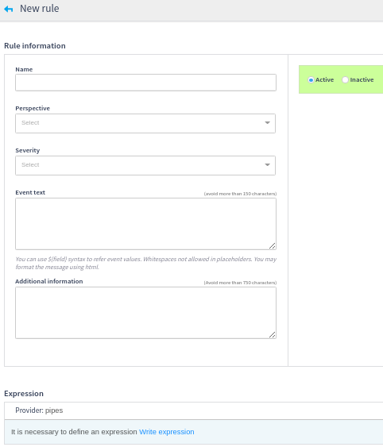
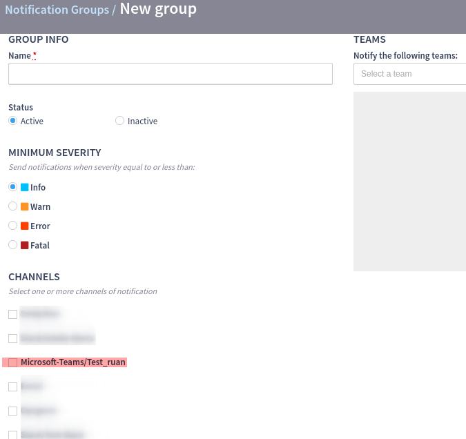

# Microsoft Teams

The Microsoft Teams plugin enables the INTELIE Live to send notifications as a **text message** to Microsoft Teams channels based on rules described by a query that can be activated or deactivated as needed. Who will be notified is also configurable, as will be shown later in this document.

.png>)

.png>)

## Microsoft Teams Setup

To send live notifications to a Microsoft Teams channel, we need first to create a [webhook](https://docs.microsoft.com/en-us/microsoftteams/platform/webhooks-and-connectors/how-to/connectors-using#setting-up-a-custom-incoming-webhook) inside of that channel, directly from Teams app.

* Create your channel or go to an existing one, search for “connectors” in the options.

.png>)

* On the new popup, select “configure” to set up a new webhook.

.png>)

* Insert a name to identify the new webhook. You can also change it’s image (the image that shows when a message is sent to the channel). Then, click on “create”.

.png>)

* The link to the new webhook will now show and the setup is complete. Now, you need to create notifications in Live and link them to your webhook.

.png>)

.png>)

## Live Setup

### Installation

The Microsoft Teams plugin is available for download on [INTELIE Live Marketplace](https://marketplace.intelie.com/artifact/plugin-microsoft-teams).

### Plugin Instance

* Create a new instance of the plugin at Live Integrations menu on Administration page.

.png>)

* Choose a qualifier, paste the previous created webhook’s link and save the new instance.

.png>)

### Rules Events

* Now, let’s set up the notifications. At the “Monitoring” tab, select the “rules” tab and create a new rule.

.png>)

* The rule will have some important information to be filled.\

  * Perspective
  * Severity
  * Text of the event (will appear as “text” attribute on Live event named “Rule Alert”)
  * Description of the event (will appear as “description” attribute on Live event named “Rule Alert”)
  * Expression

* The expression will determine when the “rule alert” event will be sent.\

* The rule can always be activated or deactivated, so that alerts events will stop being sent.

### Notification Group

* As the last step, we need to create or set up a “Notification Group”. This is the way we link the [created Microsoft Plugin Instance](microsoft-teams.md#plugin-instance) and the [rule alert event](microsoft-teams.md#rules-events) from previous sessions in this document.\

* At the Live Admin panel, select the “Notification Groups” tab and create a new one.

.png>)

* Now, choose a name for your notification group. Set up the “minimum severity”, the “teams” and “perspectives” to be notified.\

* Select the Microsoft-Teams instance you created earlier on the “Channels” checkboxes and save.

## Sharing annotations

It is possible to share notes to Microsoft Teams. For each annotation type, the environment requires an extra plugin, besides the Microsoft Teams plugin, that will define the format following the Microsoft Teams API.

.png>)

Please notice that that will generate a card in Microsoft Teams which is actually a snapshot of the note. Should the note be edited in Intelie Live, the modifications will have no effect on Microsoft Teams and the card will be outdated.

## Roadmap

It would be nice if we could:

* Send more than only text messages to the Microsoft Teams channels.\

  * Links to dashboards
  * [Cards](https://docs.microsoft.com/en-us/azure/bot-service/rest-api/bot-framework-rest-connector-add-rich-cards?view=azure-bot-service-4.0#types-of-rich-cards) with images, files attachments, buttons for user actions
  * Possibility of [outcoming webhooks](https://docs.microsoft.com/en-us/microsoftteams/platform/webhooks-and-connectors/how-to/add-outgoing-webhook) to perform actions into Live from the channels cards
