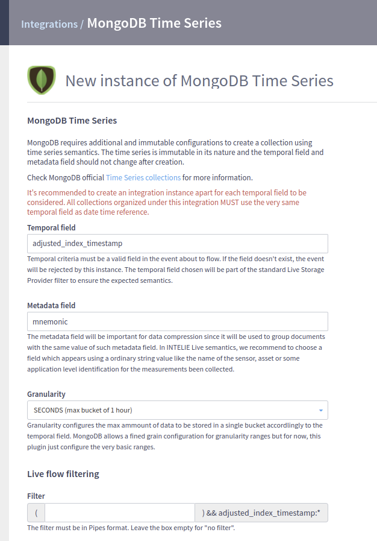

# MongoDB Timeseries

## MongoDB

For more information about classic INTELIE MongoDB plugin configuration and features, access [Plugin MongoDB](mongodb.md) docs.

## MongoDB Timeseries

Time series is a collection of data that changes over time. That way, the time when the data was recorded plays a significant role when querying and analyzing this data. MongoDB introduced in version 5.0 a new type of collection that stores time series data in an efficient way, called time series collections.

From the user's perspective, time series behaves the same as normal collections, just stored efficiently. This plugin uses time series collections instead of normal collections, since most of the data in Live is time-based, whether it's based on the usual timestamp, or other fields, like adjusted\_index\_timestamp, which will be used to create the time series collection.

In order to create a MongoDB time series collection, it's necessary to specify a `timeField` configuration indicating the document field to be used as the temporal mark. However, other immutable configurations are also crucial to be prepared before the time series creation:

* `metaField`: The name of the field which contains metadata in each time series document, identifying a unique series of documents.
* `granularity`: Value that most closely matches the time between consecutive incoming timestamps, possible values are seconds (default), minutes, and hours.

Know more about time series configurations at https://www.mongodb.com/docs/manual/core/timeseries/timeseries-procedures/#time-series-field-reference.

## Benefits

MongoDB uses a columnar storage format for time series collections, providing the following benefits:

* Improved query efficiency
* Reduced disk usage
* Reduced I/O for read operations

Know more about its benefits at https://www.mongodb.com/docs/manual/core/timeseries-collections/#benefits.

This plugin takes advantage from these benefits, for example:

* Queries that use a timestamp hint have been improved.
* Total collection storage size, including indexes, decreased by 90%.

## Risks and limitations

When developing this new plugin, we faced many risks because of time series collection limitations, but most of them were solved at MongoDB version 7.0. But we still have some risks or limitations:

* Legacy collections (collections created using the plugin MongoDB) are not supported, since they are not time series collections and cannot be converted.
* Managing multiple integrations requires some additional attention, as explained at Multiple integrations subsection.
* Each integration must have its dedicated database on MongoDB.
* MongoDB version 7+ must be used.
* Sparse index support was removed.

## Difference from plugin MongoDB

### For users

* Sparse indexes are not supported.
* Removed `eval` support, both from endpoints and the Query Provider.
* Configuring an integration, as explained at Integration config subsection.

### For developers

* To store events in a time series collection, the `timeField` must be `Date` type. To solve this issue, a new field is created when encoding the event, `intelie_time_field`, which contains the value of the configured `timeField` as `Date`. When decoding the event, this extra field is removed.
* Pipes queries using the configured `timeField` as timestamp hint use the `intelie_time_field` when querying on MongoDB.
* Because of the `intelie_time_field` extra field, indexes requests containing the configured `timeField` are mapped to the extra field.
* Upserts are not supported yet in time series collections. To keep our support to `__overwrite`, we perform a delete followed by an insert.
* The `_id` field was not being generated when inserting an event, so the plugin generates one before inserting it.
* Java and MongoDB have different maximum values when using the `Long` type, causing overflow when querying by Java `Long.MAX_VALUE` for example. Because of that, the plugin defines maximum and minimum values, respectively `8640000000000000L` and `-8640000000000000L`.

## Requirements

* Live 3.30+.
* MongoDB server version 7+.

## Configuration

### INTELIE Live Integration

Three new configurations were added when compared to the plugin MongoDB:

* `timeSeriesTimestamp`: temporal field to be used as `timeField` when creating the time series collection. The value must be the field used as timestamp hint when querying for better performance, examples: `timestamp`, `adjusted_index_timestamp`.
* `timeSeriesGrouping`: grouping field to be used as `metaField` when creating the time series collection. The value should be the field used in where clauses when querying for better performance, example: `mnemonic`.
* `timeSeriesGranularity`: frequency of data, to be used as `granularity` when creating the time series collection.

In addition, an automatic configuration is done. Since each integration can have events following the same time series configuration, the integration field is concatenated with `adjusted_index_timestamp:*` filter (supposing the `timeSeriesTimestamp` is `adjusted_index_timestamp`). So, to be stored at that integration, an event must contain the field specified as `timeSeriesTimestamp`.

Note that all these configurations are applied to all collections stored in that integration.

Multiple timestamp hints are not supported and the usage of storage timestamp hint other than the temporal field will rely on MongoDB on-the-fly sorting and it will be time-consuming.

### Multiple integrations

Since each integration is configured using only one `timeSeriesTimestamp`, multiple integrations must be created if the user wants to manage various time-based fields. Also, each integration **must** have its dedicated database, otherwise, events will show up twice on the queries. Each integration will filter events based on the presence of the time field.&#x20;

There are some situations you must be aware that can lead to configuration errors:

1. **Multiple time fields in INTELIE events:**
   * An event may contain more than one date time field, with each field configured for a different integration.
   * Since there is no way to predict which integration will store the event, query performance may be negatively impacted depending on the date time field used in the query.
2. **Ordinary `timestamp` field configured as `timeSeriesTimestamp`:**
   * If an integration is configured to use the `timestamp` field as the `timeSeriesTimestamp`, conflicts may arise because, in INTELIE Live, all events inherently contain the `timestamp` field as a mandatory field.
   * This configuration prevents the use of other fields as `timeSeriesTimestamp` in other integrations, limiting flexibility.
   * To avoid this issue, the integration filter must explicitly exclude all other fields configured as `timeSeriesTimestamp` in any integration. For example:
     * Let's assume you want to store, in a MongoDB timeseries database, only events that don't contain `adjusted_index_timestamp` because that is already configured in another exclusive database for normalized data (as given by Plugin LiveRig).
     * So, you will need to configure the write filter of the new integration as `-adjusted_index_timestamp:*` (negating any event which has an adjusted\_index\_timestamp field) since the effective write filter compiled by the plugin in this case will be `-adjusted_index_timestamp:* && timestamp:*` (see the [Pipes automata for this filter](https://pipes-tutorial.intelie.com/explain/#-adjusted_index_timestamp%3A*%20%26%26%20timestamp%3A*/true/true)).
     * Extending this example to a third integration exclusive for events containing `liverig__index__timestamp` as temporal criteria, you will need the following write filters:
       * adjusted\_index\_timestamp integration: `* && adjusted_index_timestamp:*`&#x20;
       * liverig\_\_index\_\_timestamp integration: `-adjusted_index_timestamp:* && liverig__index__timestamp:*`&#x20;
       * timestamp integration (like a fallback for the complementary data): `-adjusted_index_timestamp:* && -liverig__index__timestamp:* && timestamp:*`

If you also need assistance configuring both MongoDB Timeseries integrations and MongoDB classic integrations (as documents), you can use [MongoDB Kit plugin](mongokit.md). This plugin allows you to manage both document-based and timeseries-based databases within a single configuration form.
