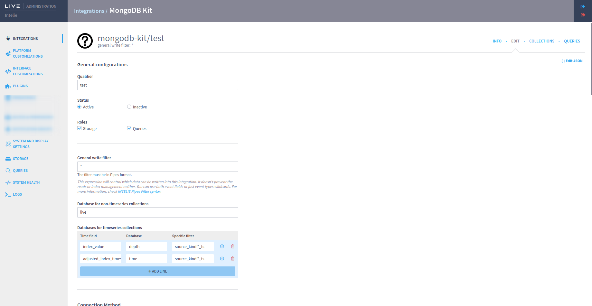
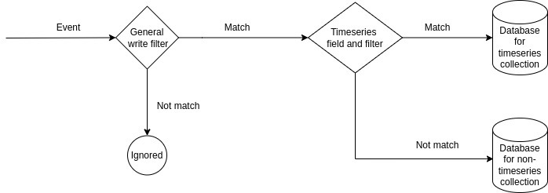
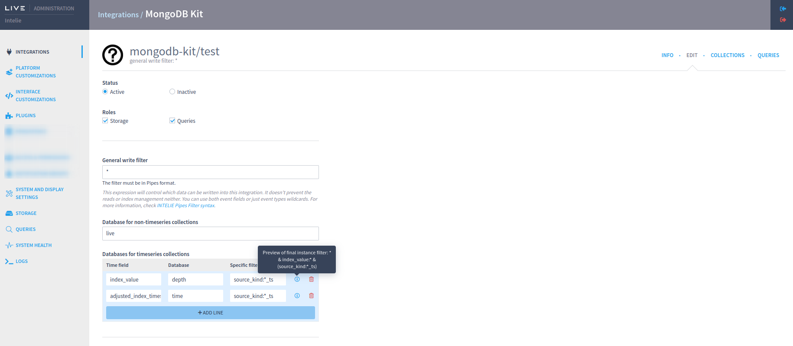
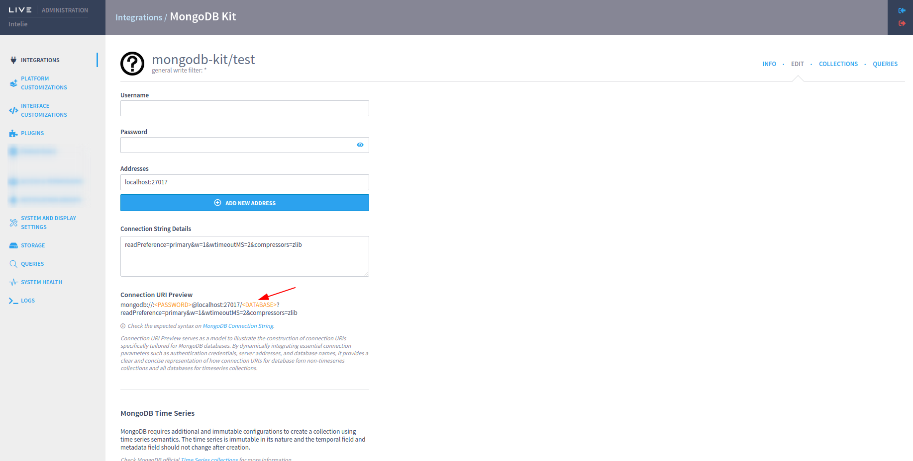
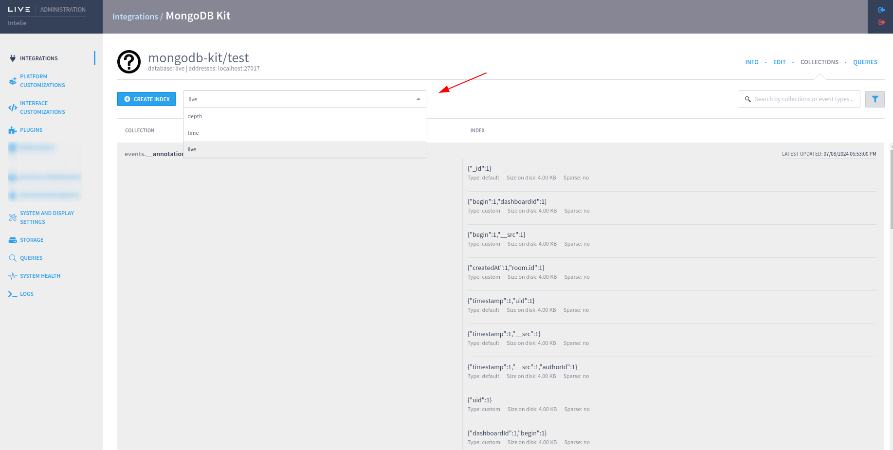
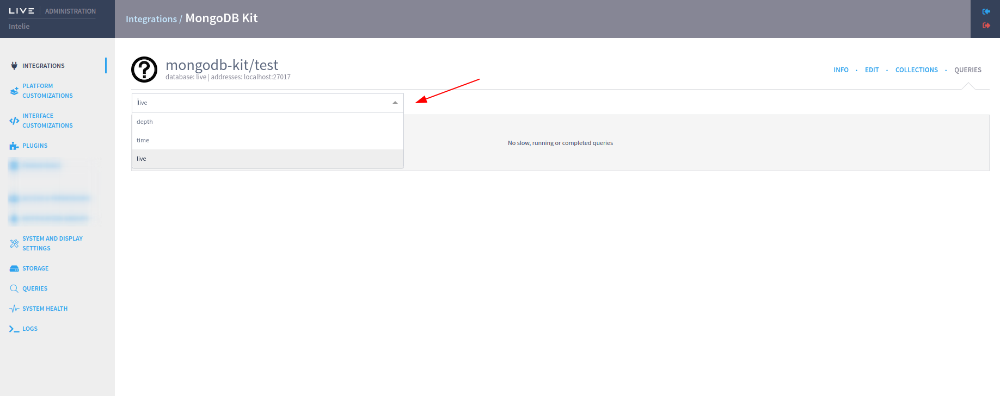
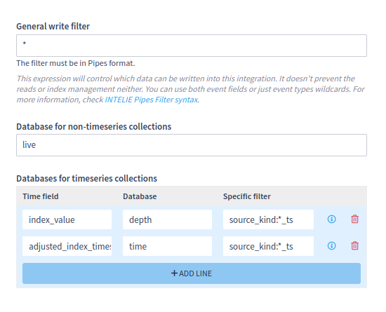

# MongoKit

MongoKit is a tool that enables users to configure MongoDB timeseries instances alongside a MongoDB instance for temporal collections. With MongoKit, users define the temporal fields and the respective MongoDB timeseries databases that will store events matching each temporal field and filter defined by in "Databases for timeseries collections". Events that do not match any of the timeseries configurations of an integration will be directed to the database defined for non-timeseries collections (or that do not match any timeseries) in "Database for non-timeseries collections".

## Overview

### Key Features

- **Timeseries and Non-Timeseries Database Integration**: Configure and manage both timeseries and non-timeseries MongoDB instances within a single integration.
- **Unified Authentication and Configuration**: Use the same configuration and authentication settings for all databases within a MongoKit integration.
- **Flexible Event Routing**: Define a general write filter and specific filters that directs events to the appropriate timeseries or non-timeseries databases.

## Configuration

### General Write Filter and Specific Filters

The General Write Filter defines the entry flow for the MongoKit integration. Events that match this filter can be routed to one of the defined MongoDB timeseries databases according to their temporal fields and specific filters. If an event does not match any timeseries configuration, it will be directed to the non-timeseries instance defined in the integration.

### Databases for Timeseries Collections

For each MongoDB timeseries database, specify:
- **Database Name**: The unique name of the timeseries database.
- **Temporal Field**: the temporal field of the data.
- **Specific filter**: Specific filters that determine which events should be stored in this timeseries database.

The** filnal filter** for each mongoDB timeseries database is a combination of 
`[General Filter content] && [the timeserie timefied]:* && [specific filter content if defined] `.
The event that match with the final filter will be routed to that timeseries instance.

### Database for Non-Timeseries Collections

Specify the MongoDB instance for collections that do not match any timeseries configuration:
- **Database Name**: The name of the non-timeseries database.

If the event mach with the General Write Filter but don't match with any timeseries instance filters, it will be routed to this database.
Note that General write filter is considered also for non-timeserie database. So the final filter for this instance is General filter less all the timeseries specific filters combined.
`[General Filter content] && -([timeseries filter 1] || [timeseries filter n] )`

## Authentication and Configuration

All databases within a MongoKit integration utilize the same configuration and authentication settings. This simplifies management and ensures consistency across all instances created by the integration.

### Connection URI

When using the Connection URI option as a connection method, a URI will be generated to connect to the database for non-timeseries mongo and a URI for each database listed in the timeseries table. 
The generated URI follows the same pattern for all databases, changing only the <DATABASE> field, which will be filled in using the name of each database entered.

## Collections and Queries

Due to the configuration of more than one database in mongo-kit, a selector was added to the Collections and Queries tabs to choose which database you want to check the data.

## Usage Example

### Step-by-Step Guide

1. **Define General Write Filter**: Set up the general write filter to determine the initial routing of events.
2. **Configure Timeseries Databases**: Specify the temporal fields and filters for each timeseries database.
3. **Set Up Non-Timeseries Database**: Define the database for non-temporal events.
4. **Setup common fields for your application**: Ensure all databases use the same configuration and authentication set in the plugin.

## Best Practices

- **Unique Database Names**: Ensure each MongoDB timeseries database has a unique name within the MongoKit integration.
- **Comprehensive Filters**: Define comprehensive filters to accurately route events to the appropriate databases.

## Troubleshooting

### Common Issues

- **Event Routing Errors**: Verify the general write filter and individual timeseries filters are correctly configured.
- **Authentication Failures**: Ensure the authentication settings are correctly applied to all databases.
- **Database Conflicts**: Confirm that each timeseries database has a unique name within the integration.