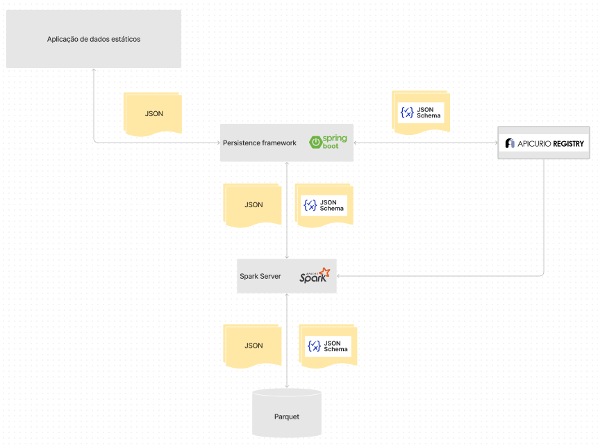
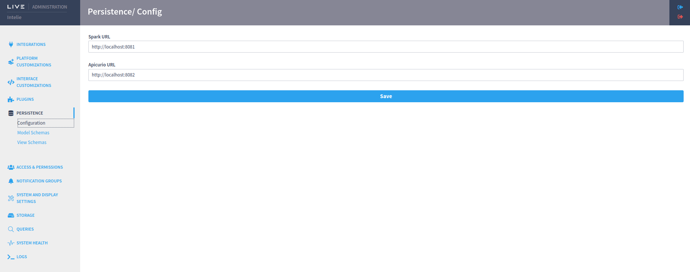

# Static Data Persistence Framework

## Static Data Persistence Framework

The Static Data Persistence Framework (SDPF) main objective is to facilitate the creation of contracts related to reading and writing static data, through JSON schemes that represent the business logic of a specific domain.

In just a few steps, the developer has access to the static data management APIs. Simply defining the data models in JSON schemas and using the generic APIs available through a LIVE service can now be used for data CRUD.

## Architecture

The Static Data Persistence Framework is divided into 4 blocks, where each of these blocks has a specific functionality for the plugin to work.

The persistence framework block aims to provide the endpoints that the static data application needs to perform data CRUD.

It also provides, through the live settings, a way for the json schema to be stored in the system to link them to data in the future.

Apicurio aims to manage the jsons schemas it uses. Its function is to be a facilitator when storing and using the jsons schemas necessary for the application.

The spark server operates as a middleware between persistence and the parquet database, where endpoints are made available for including data along with its json schema so that it can be persisted in a parquet database.

The parquet is where data from the application is stored along with the json specified for that type of data.

## Features

In version 1.0.0 we have the following features for SDPF:

* Domain schema modeling

* Generic REST API for accessing data through LIVE services

* **POST**
* **PUT**
* **DELETE**
* **GET**

## Modeling schemas and modeling schema subsets

Modeling schemes are the schemas that serve the basic modeling of the data that you want to persist, it works like creating a table in a relational database, where each of the fields in the schema act as if they were a field in the table, and the data of this schema must meet these fields to be saved.

To save a new schema, you need to go to the live system administration area, click on the persistence tab and the model schemas option, this way the screen below will be displayed.

The model to be saved must meet the criteria of a json schema. Some examples can be found on this [website](https://json-schema.org/learn/miscellaneous-examples).

The modeling schema subset is the search and retrieval of part of the data from a modeling schema, where only some fields are returned. An analogy is to think that only some fields in a table are returned in the search.

## How to use generic APIs for data CRUD

After installing and configuring the Static Data Persistence Framework, simply import it into the application you want to use it and make use of the endpoints. Some usage examples can be seen in the Use case section: Using the persistence framework in AVI or directly in the live video player plugin branch.

The list of all available endpoints is found in the StaticDataResource class.

It is also necessary that the Spark Server and apicurio are running on some port, and these ports must be defined in the persistence option in the live settings.

## Version limitations

In this version 1.0.0 we still have some usage limitations that will be listed below:

* **The use of view schemas is not available:** Although it is possible to limit the number of fields that can be searched in a modeling schema, it is not possible to aggregate several schemas and return a new set of data that encompasses the data from these schemas.

* **It is not possible to remove a schema:** Apicurio provides the removal of a schema and the removal endpoint is created, but removing a schema without any processing of the data that is saved generates inconsistency in the database. There are several possibilities to address this problem, but it is necessary to better understand the plugin's use cases in order to apply the most comprehensive approach to several different uses.

* **It is not possible to change a schema:** The motivation is the same as in the removal case.