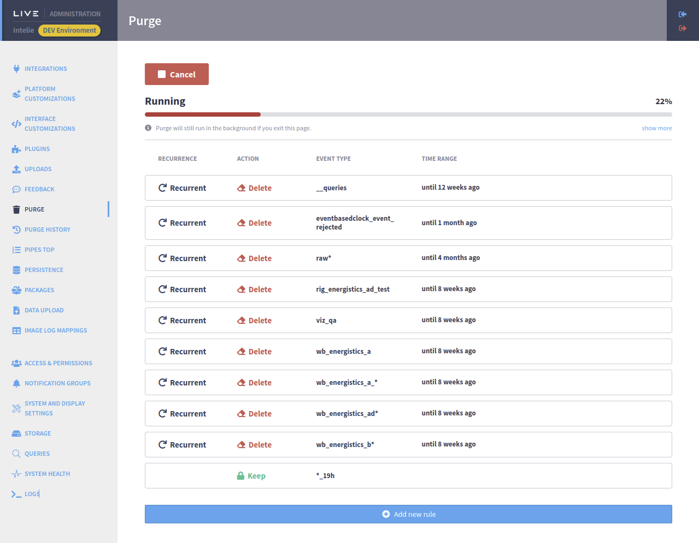
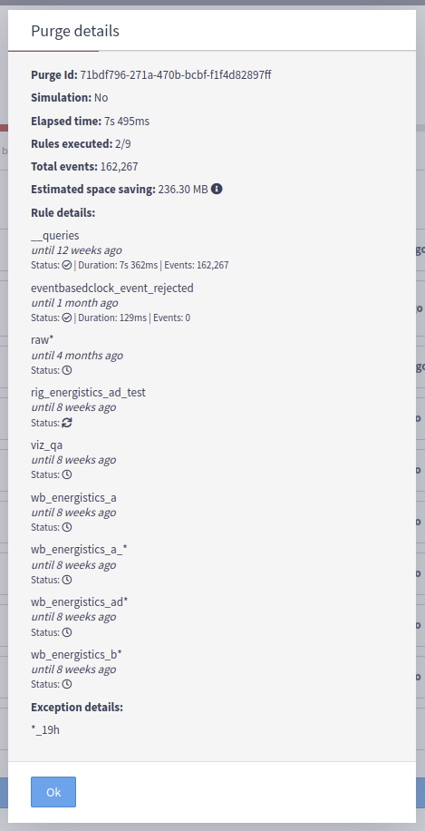

# Purge plugin

## Purge Plugin

The plugin purge delivers a new design for the INTELIE Live Purge subsystem. It improves the purge performance using batch operations supported by Live Storage Providers.

This document provides an overview of the new purge plugin and the features of the recently released 1.1.0 version. In addition, it compares the new plugin with the Live purge subsystem and describes the features planned for the upcoming version.

Even though the purge plugin does not yet cover all features of the Live Purge subsystem, it improved the purge performance. In local tests, the purge executed three times faster using the new plugin compared with the current subsystem. There is no plan to remove the Live Purge subsystem, so it can still be used.

## Features

### Configuring rules

After installing the plugin, two new options will be available on the admin menu: **Purge** and **Purge History**. The rules are available on the Purge page.


The first time accessing this page, no rules will be configured and the following message will be shown. You just need to click on the button to create a new rule.


A rule has three configurations:

* **Event type**: the type that will be purged; if you don't find it in the dropdown, you still can type and an "create" option will display;
* **Time range**: the span or time interval to be purged, e.g., until 1 month ago, 2022-11-21 00:00 to 2022-11-30 23:59;
* **Recurrence**: a rule can be executed only manually on this page (one-time), or it can be scheduled (recurrent) to execute both manually and automatically based on the configured cron, which we will cover later in this document.


After saving a rule, a list of rules will appear. In this list, a rule can be edited or deleted.

.png>)

Once at least one rule is configured, two new buttons will be available:

* **Simulate**: runs a simulation to estimate how many events would be deleted considering the configured rules;
* **Run purge**: runs a real purge, deleting events based on the configured rules.


When a **Simulation** or **Purge** is running, a cancel button replaces the **Simulate** and **Run purge** buttons and can be used to cancel the current task. The status of the current execution and a progress bar will be displayed. The progress bar shows the progress regarding the number of purge rules executed.



There is also a “show more” button, which will show more details about the current task execution.



### Checking previous executions

It’s possible to check previous purge executions on the **Purge History** page.


A list of executions and their information are displayed, along with the “show more” button, which will show more details.

### Purge status

The status of a purge execution is displayed on the Purge History page, but it can also be checked using the `__plugin_purge` event type. A purge execution can have five statuses:

* **Waiting**: only four simulations can run in parallel, or one “real” purge at a time. Other executions will be waiting until these limits are reached.
* **Running**: the purge execution is running.
* **Completed**: the purge execution finished successfully.
* **Canceled**: the purge execution was canceled, by the user or by the auto-cancelation feature.
* **Failed**: some error caused the purge execution to fail.

### Periods configured as time range

It's crucial to configure the correct period expression to purge. Small differences in the Pipes period semantics would lead to critical errors by purging wrong data. It's mandatory to be aware and conscious of the semantics of the period configured.

A person with administrative access can use the Pipes console to debug the period expression. See the complete documentation at [https://pipes.intelie.com/docs/0.25.9/#scalar-span](https://pipes.intelie.com/docs/0.25.9/#scalar-span) .&#x20;

Check an example below:

```
=> every 1 minute
=> @set span('last 2 months')|>:dateformat as last_two_month
=> @set span('until 2 months ago')|>:dateformat as until_two_month_ago
```

Results:

* **last 2 months** will drop only events from 2024-09-21 until now (2024-11-21)

```
last_two_month:
{
  "timestamp": "2024-11-21T11:21:00",
  "start": "2024-09-21T11:21:00",
  "end": "2024-11-21T11:21:00"
}
```

* **until 2 months ago** will drop only events from the beginning until 2 months from now (2024-09-21)

```
until_two_month_ago:
{
  "timestamp": "2024-11-21T11:21:00",
  "start": "1969-12-31T21:00:00",
  "end": "2024-09-21T11:21:00"
}
```

#### What to avoid?

An example of a risky expression "until last 2 months ago" will drop to **everything** (it's equivalent to "from ts 0"); typically, that is **not** the original intention but the person can misunderstand the combination of **until** and **last** keywords.

```
until_last_two_month:
{
  "timestamp": "2024-11-21T11:21:00",
  "start": "1969-12-31T21:00:00",
  "end": "2024-11-21T11:21:00"
}
```

So validating your period expression upfront using the `span()` function in Pipes console is strongly recommended.

## Purge system settings

All settings of the purge plugin are located on the **System and Display Settings** administration page.


### Maximum duration configuration

It’s possible to configure a maximum duration for a purge execution. When the duration is exceeded, the task will be automatically canceled.


### Scheduled rules configuration

The scheduled execution of purge rules can be enabled or disabled with the first toggle button. Then there’s a Cron configuration, which has its own syntax to period of time (https://crontab.guru/). If the scheduled execution is enabled, all purge rules configured as Recurrent will be executed based on this periodicity. In the example below, all recurrent rules would be executed every day at 10:55AM.


## Comparing the new plugin against the classic Live purge system

The classic Live Purge system is deprecated in Live v3 series and it's expected to be removed on Live v4 in favor of the Purge plugin.

### Simulation performance

A collection with approximately 11.000.000 events was created and then simulations using the new plugin and the current system were executed. It took 25 seconds on the new plugin, and 59 seconds on the current system.

 

### Purge performance

The same collection with 11.000.000 events was used to run a real purge, deleting the events using both strategies. It took 2 minutes and 30 seconds using the new plugin, and 6 minutes and 22 seconds using the classic system.

 

### Features comparison

| Feature                                                    | Classic Live purge | New purge plugin |
| ---------------------------------------------------------- | :----------------: | :--------------: |
| Schedule purge execution                                   |          -         |     ✅ (1.0+)     |
| Reduce the memory footprint and cpu usage on Live          |          -         |     ✅ (1.0+)     |
| Specify a maximum duration                                 |          -         |     ✅ (1.1+)     |
| Specify wildcards on the event type name                   |          ✅         |     ✅ (1.2+)     |
| Specify any pipes filter on rule expression                |          ✅         |         -        |
| Specify event type (or datasource) exceptions from purging |          ✅         |     ✅ (1.2+)     |
| Cancel the purge/simulation execution                      |          ✅         |     ✅ (1.2+)     |
| Free space estimation                                      |          ✅         |     ✅ (1.3+)     |

## Limitations

* It is not possible to estimate how much time a purge execution will take to finish based on its rules.
* The `__plugin_purge` events are emitted after each rule is executed, so the user will not notice any changes on the interface until a rule is finished. If a rule takes too long, the progress will also take this time to be updated.
* The purge task can’t be canceled if a rule is already started its execution. The user is forced to wait until the current rule execution is finished and then the overall process will be canceled. If a rule takes too long, the cancel will not be noticed immediately.

