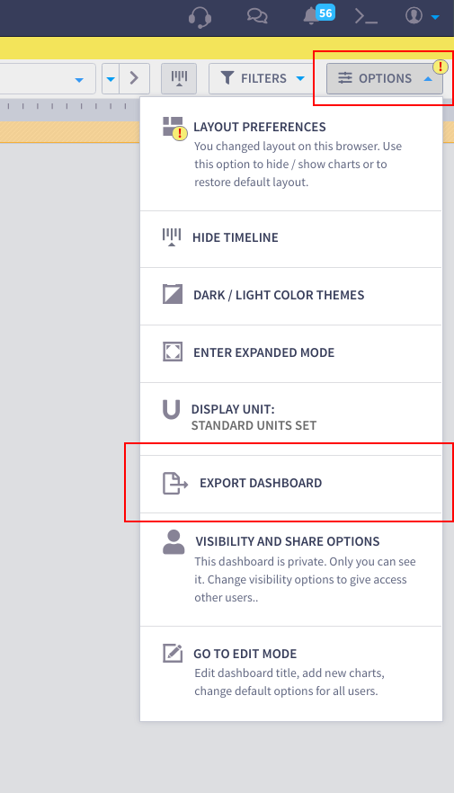
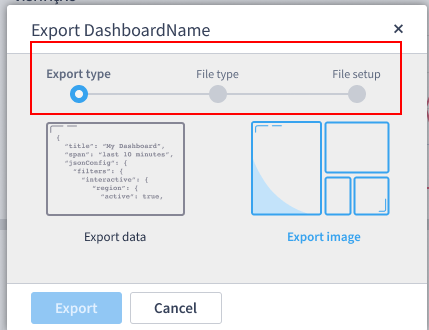
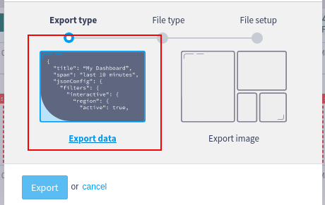
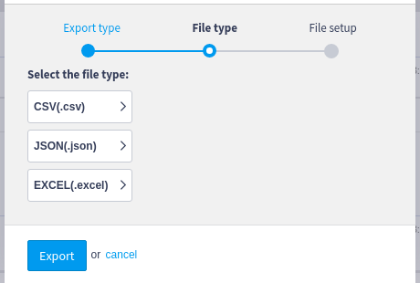
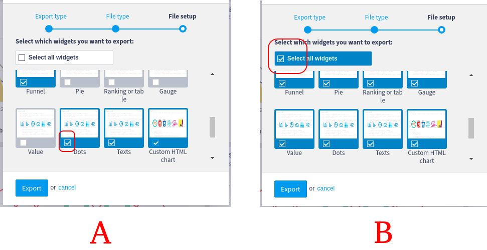
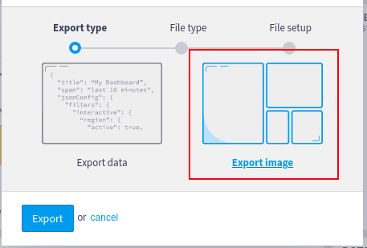
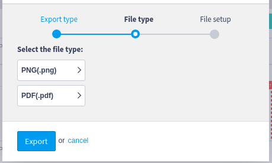

# Export Dashboard

### Export Dashboard Wizard

This wizard is capable of assisting you on both exporting the **dashboard data** (the data in each individual widget combined into a single CSV, JSON, or Excel file) and the **dashboard visual content** (a print screen of the dashboard as a PDF or PNG file), as shown in Figure 1.

To access the export dashboard wizard click "Options" on the dashboard page and then select the "Export Dashboard" option as shown in the image below:

#### Export Process (Data & Image)

The dashboard export process is divided into three steps: (1) Export type, (2) File type, and (3) File setup.&#x20;

Step 1 is used to choose the export type, it is possible to choose between two different options: _Export Data_ and _Export Image_. The _Export Data_ option is used to export the data of each individual widget in the dashboard combined into a single file. The _Export Image_ option is used to export a visual representation of the dashboard, just like a screenshot.

Step 2 is used to choose between the different formats that each export type has to offer. While "Export data" offers CSV, JSON, and Excel, the "Export image" offers PNG and PDF.

Step 3 is also based on the export type. If you want to export data, then this step allows you to choose which widgets you would like to export. But, if you want to export an image, this step will let you configure the image size or orientation of the PDF.

Regardless of the step you are in, this wizard allows you to go back to a previous step by clicking in the circle or step name at the top of the wizard.&#x20;

#### Export Data

The "Export data" option can export the data from all the widgets in the dashboard as a CSV, JSON, or Excel file. To do this, you need to choose the option "Export Data", as shown in Figure 4.

After choosing the export type, the wizard will present all the available file types. Currently, for the data export type, there are three different file types to choose from: CSV, JSON and Excel.

Select the desired file type and the wizard will move to the final step. As Figure 6 shows, the final step allows you to choose the widgets that you want to export. You can choose each widget individually (A) or all of them with just one click (B).

When you are done with the selection, just click on "Export". The wizard will export the data from all the selected widgets and organize it in one file based on the chosen format in step 2.

#### Export Image

The option "Export image" can export a visual representation of the entire dashboard as PNG or PDF. To do this, you need to choose the option "Export image", as shown in Figure 7.

After choosing the export type, the wizard will present all the available file types. Currently, for the image export type, there are two different file types to choose from: PDF and PNG.

Select the desired format and the wizard will move to the final step. As Figure 9 shows, the final step allows you to configure the size of the image (A) or the PDF orientation (B).

When you are done with the configuration, just click on "Export" and the wizard will export the image or PDF.

####
