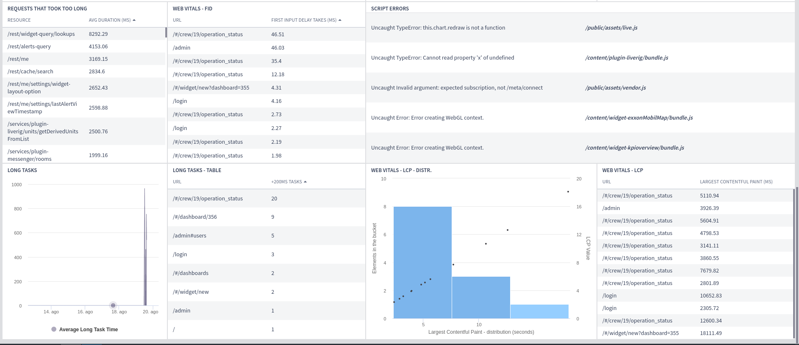

# WebApp Metrics

### Metrics

All the metrics are related to the frontend performance and can be accessed via query pipes. In total there are five metrics, three of which are from the [Web Vitals](https://web.dev/vitals/) initiative and the remaining two are from the [performance API](https://developer.mozilla.org/pt-BR/docs/Web/API/Performance).

#### LCP (**Largest Conteful Paint**)

The Largest Contentful Paint (LCP) metric reports the render time of the largest image or text block visible within the viewport, the idea being that the largest element might be the most important one to the user.

If a page is reporting high values for this metric, it means that the most important element in that page takes too long to appear on the screen.

This metric is available in pipes through the following filter:

```
webhit type:"webapp_performance" hit->category:"web-vitals" hit->variable:"LCP"
```

#### FID (First Input Delay)

With this metric is possible to measure how long does it take for the browser to react to the user's first input. During page load, if the browser is busy doing something and the user interacts with a button, the time it takes for the browser to start responding to the user interaction is the FID.

This metric is available in pipes through the following filter:

```
webhit type:"webapp_performance" hit->category:"web-vitals" hit->variable:"FID"
```

#### CLS (Cumulative Layout Shift)

Layout shifts are defined by the Layout Instability API, which reports layout-shift entries any time an element that is visible within the viewport changes its start position (for example, its top and left position in the default writing mode) between two frames. Such elements are considered unstable elements.

This metric is available in pipes through the following filter:

```
webhit type:"webapp_performance" hit->category:"web-vitals" hit->variable:"CLS"
```

#### Long Tasks

Those are javascript tasks that took more than `400ms` to complete. Long tasks can happen anywhere in a page lifecycle. Pages that report a high number of long tasks need some attention.

In a scenario where page A has an average of 2 long tasks per visualization and after a Live update that number spikes to 8, is safe to say that something changed during the Live update and it needs some attention.

This metric is available in pipes through the following filter:

```
webhit type:"webapp_performance" hit->category:"web-vitals" hit->variable:"LT"
```

#### Long Requests

Long requests are any HTTP requests that take more than `450ms` to complete. That metric is useful when looking for endpoints that need to be optimized.

This metric is available in pipes through the following filter:

```
webhit type:"webapp_performance" hit->category:"web-vitals" hit->variable:"LR"
```

### Web Metrics Dashboard Template

Live provides a way to create a template dashboard with all the metrics described above in it.

To create a new web metrics dashboard go to the dashboard list page and click on the "New dashboard" button as shown below:

.png>)

After that, a modal listing the available options to create a dashboard will appear on the screen, select the "Use a model" option as shown on the image below:

.png>)

Finally, select the "Access Monitoring" model and fill in the dashboard name and perspective and click on the "Create" button.

.png>)

The newly created dashboard will look like this:


