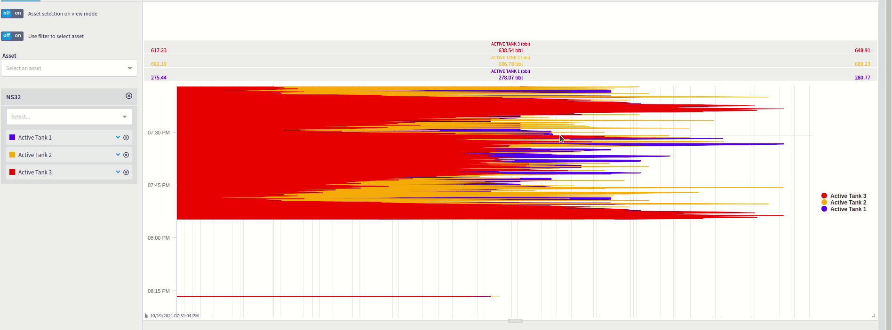

# 3.10.0

## New features

* New Plugin Admin interface
* Ability to change the position of each series in the widget header

## Fixes and improvements

* Update pipes to 0.25.2
  * Ignore I/O error in sys.disks
  * Fix UnionPipe and JoinPipe behavior with empty batches
  * Fixed Exprange for step equals to 1
  * Exprange should be finite
* \[fixed] Failsafe screen should not show PANIC buttons to non-Admins&#x20;
* \[API] Deprecate redo() and undo() from Live.Action
* Add "final computed span" to \_\_queries event
* Performance improvement to Lookup Table interface

## Details

### New Plugin Admin interface

.png>)

Live 3.10 introduces a new Plugin Admin Interface.&#x20;

It includes:&#x20;

* A new search functionality

.png>)

* A new filter functionality&#x20;

.png>)

* More information about the Plugin status

.png>)

* More information about dependencies, including links to the [marketplace](https://marketplace.intelie.com/)

.png>)

* Bulk action

.png>)

### Ability to change the position of each series in the widget header

This new feature allows the user to change the series order. This will affect the header, the legend, and the chart itself. As we can see at this gif, whenever the user changes the position of a series (curves, layer, etc...) using the drag-and-drop at the header, all the related information gets updated.&#x20;
