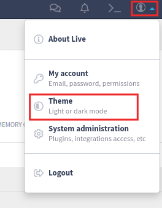
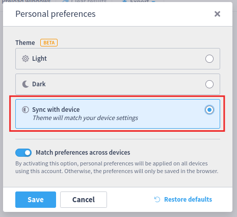
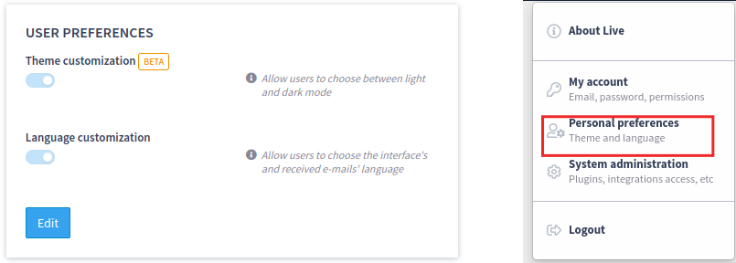
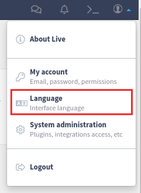
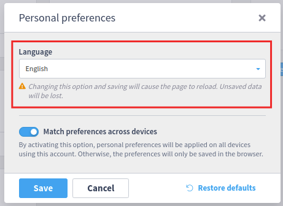
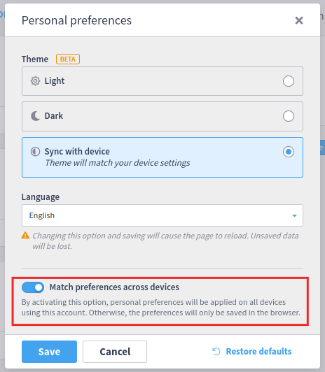
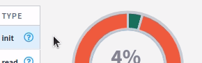

# 3.33.0

### New Features

* Allow users to use system theme ([more](3.33.0.md#allow-users-to-use-system-theme))
* Allow users to select their language ([more](3.33.0.md#allow-users-to-select-their-language))
* Allow users to sync personal preference options across devices ([more](3.33.0.md#allow-users-to-sync-personal-preference-options-across-devices))
* New Entity Audit API ([more](../../features/entity-audit.md))

### Fixes and improvements

* Add option for web settings items to define the columns breakpoints for their settings section
* Deprecates Live purge built-in subsystem and new optional flag to hide legacy purge administration menu
* Exception from http service is not being logged
* Improve Live tooltip ([more](3.33.0.md#improve-live-tooltip))
* Adds validation at the home customization card ([more](3.33.0.md#adds-validation-at-the-home-customization-card))
* Allow admin users to hide and rename the "home" menu using the home customization feature ([more](3.33.0.md#allow-admin-users-to-hide-and-rename-the-home-menu-using-the-home-customization-feature))

### Details

#### Allow users to use system theme

Live users can now choose to follow its device theme mode. In order to do so, the user needs to click on the top-right button and, them, choose "Theme".

If you don't find the option "theme", verify in Live admin if the option `System & Display > User preferences > Theme customization` is activated. Please note that, if the "Language customization" toggle is also on, the option will be called "Personal preferences" instead of "Theme".

#### Allow users to select their language

Live users can now choose their preferred language. To do so, the user needs to click on the top-right button and, them, choose "Language". The preferred language will be used in Live interface and received e-mails. Entities names (like dashboard names) will not be affected.

After that, the user can choose their preferred language:

If you don't find the option "Language", verify in Live admin if the option System & Display > User preferences > Language customization is activated. Please note that, if the "Theme customization" toggle is also on, the option will be called "Personal preferences" instead of "Language".

#### Allow users to sync personal preference options across devices

At "Personal preferences menu", the user can choose either to:

* **Use its language and theme preferences only in the current browser:** when choosing this option, the personal preferences will be saved at the browser local storage
* **Match preferences across devices/browser:** any other device/browser using the same Live account will receive the same preference configurations


Local preferences will always have priority over preferences saved across devices.


### Improve Live Tooltip

Improve the Live Tooltip style, add animation, make it compatible with dark theme, and prevent it from being displayed out of the viewport.

<figure><figcaption>
Live Tooltip - before
</figcaption></figure>

<figure><figcaption>
Live Tooltip - after
</figcaption></figure>

We strongly recommend plugin developers to use the Live tooltip instead of using some library (such as react-bootstrap or floating-ui) directly.

### Adds validation at the home customization card

Some validations were added at the Home page configuration admin card. To learn more about this feature, access its [documentation](../../administration/configuration/home-page.md).

<figure><figcaption>
Home page customization - validation
</figcaption></figure>

### Allow admin users to hide and rename the "home" menu using the home customization feature

Allow admin users to hide and rename the "home" menu. To learn more about the home customization feature, access its [documentation](../../administration/configuration/home-page.md).

<figure><figcaption>
Home page customization - "Home" menu customization
</figcaption></figure>
