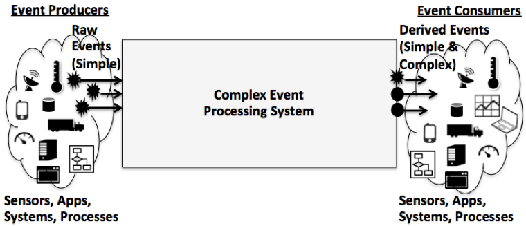
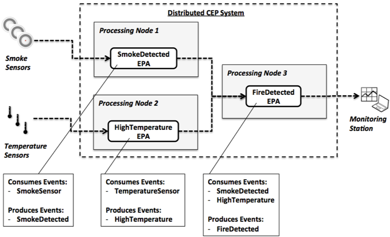
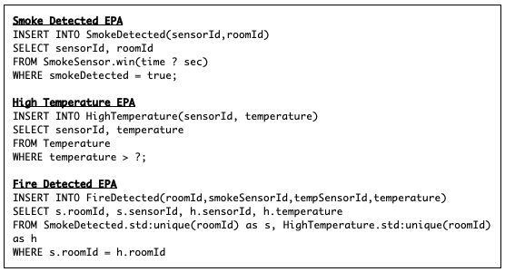

# Fundamentals

## **Event Processing Systems**

Complex Event Processing Systems are based on R\&D initiatives that have taken place over the last decade, which emerged from the new requirements imposed by monitoring applications and reactive systems. The interaction model in these applications is asynchronous, i.e. they receive data from external sources (e.g. sensors, other systems, etc), instead of humans submitting transactions, monitor continuous streams of data to detect patterns that represent situations of interest, and then notify the interested parties about those situations \[1].

While traditional database management systems provide many desired features such as persistence, consistency and many others, the synchronous and transactional model of these databases, where the database is a passive entity that waits for interactions initiated by clients, make them not adequate to meet the requirements of those reactive monitoring applications, such as high throughput, low detection latency and scalability \[1], \[2]. For example, by using a traditional database system, storing received data to then mining that database looking for patterns would require the application to periodically poll that database with synchronous queries that block until results are received.

Event processing systems, on the other hand, are very well suited for this class of applications, due to their inherently asynchronous model, where continuous streams of data (i.e. data/event streams) are continuously analyzed with respect to some rules, which automatically trigger asynchronous notifications about detected situations of interest. There are two main categories of event processing systems, which, although having similar characteristics, emerged independently from different academic communities: Data Stream Management Systems (DSMS) (also known as Data Stream Processing (DSP) systems) and Complex Event Processing (CEP) systems \[3].

Data Stream Management Systems (DSMS) \[2] are an evolution of Active Database Systems \[5] and use the concept of continuous or active queries, which are database queries that keep producing results in real-time while the database is updated. In DSMS, the semantics of the processed data streams is not defined, leaving this attribution to database clients. Complex Event Processing (CEP) systems \[4], on the other hand, have been influenced by many different communities, such as business process automation, control systems, network monitoring, sensor networks, middleware, among others \[3], and its origins can be traced back to publish/subscribe systems \[6]. CEP concerns with the processing of event notifications for identifying situations of interest, where events are pieces of information at different levels of abstraction, with inherent semantics and coming from different sources. For example, comparing CEP with content-based publish/subscribe, the former provides the capacity of specifying relationships not only over event attributes but also relationships between different types of events (and their attributes). In addition, it allows taking into account the history of already received events, and most importantly, allowing subscribers to express interest in composite events. Thus, the expressiveness of CEP also exceeds the capabilities of DSMS, since it provides the ability to detect complex patterns of conjunctions and disjunctions, sequencing, ordering, and other types of relationships among events. The following section explains CEP in more detail.

### **Complex Event Processing**

Complex Event Processing (CEP) is a technology for online situation detection in event streams, whose usage has rapidly grown since it is very well suited to support monitoring applications in many domains. It provides an asynchronous processing model, where _CEP rules_, which are _Event-Condition-Action (ECA) rules,_ are set-up in a rule-based _CEP engine_ to continuously process event streams. The CEP rules use operators (e.g. logical, quantifiers, counting, temporal, spatial and sequencing operators) and apply them on received events seeking for correlations among them, and generating the corresponding complex, or composite, events that summarise the combination of constituent elementary events. A _complex event_ is thus a higher-level abstraction representing a situation derived from the occurrence of _simple events_ (i.e. events not composed by other events), for example, a complex event c1 representing the occurrence of an event e1 followed by an event e2 (c1 = e1 --> e2). Defining such causality relations allows the tracking of events that caused a specific event to happen. The ability to express temporal properties among events allow CEP rules to establish temporal relationships among them (e.g. to detect event sequences), and to process events within specified time windows (e.g. to detect the events that happened in the last few minutes, or to detect the absence of an event, which requires a time-bound for the negation rule to match). It is also possible to define aggregation functions over event attributes observed in sets of events, such as the average, maximum or minimum attribute values of observed event sets \[4].

Entities instrumented with mechanisms for collecting context or any other type of data generate events into the system. Those can be physical entities, such as mobile nodes (e.g. smartphones, vehicles, onboard sensors) or stationary sensors, such as weather monitoring stations, ambient sensors (e.g. temperature, smoke detectors, door sensors, motion detection sensors, cameras, etc). In addition, entities in a virtual environment can also be instrumented to generate events for the purpose of monitoring, such as other systems, objects, logs, servers, operating systems, etc.

As shown in Figure 1, a CEP Engine receives streams of _raw events_ generated by different data sources (e.g. sensors), continuously processes these event streams using the CEP rules and generates _derived events_ (i.e. events that have been generated as a result of the event processing). Raw events are usually simple (although can be complex in some scenarios), while derived events can be simple or complex. The derived events are then sent to event consumers (e.g. the monitoring applications) interested in receiving notifications about the occurrence of the high-level situations described by the CEP rules \[7]. A _data dissemination service_ transports the events from data sources to the CEP system, and the derived events generated by the CEP system to all interested event consumers.

#### **Event Processing Agents (EPAs) and Event Processing Networks (EPNs)**

Event Processing Agents (EPAs) - _The concept of EPA is not related to, and shall not be confused with, the concept of “agent” in Agent-Based Models or Multi-Agent Systems_ - are software modules that process events. More specifically, they are entities that implement a part of the entire event processing logic between event producers and event consumers, encapsulating some operators and CEP rules. The type of an EPA is defined by the behavior it implements (i.e. the behavior of the CEP rules it deploys), such as filtering, transformation (e.g. translation, aggregation, splitting, composition) and pattern detection \[7].

An Event Processing Network (EPN) is a network of interconnected EPAs that implement the global processing logic for a situation detection through event processing \[7]. In an EPN, the EPAs are conceptually connected to each other (i.e. output events from one EPA are forwarded and further processed by other EPAs) (see Figure 3), without regard to the particular kind of underlying communication mechanism (e.g. push- or pull-based) used by the data dissemination service.

#### **Distributed Complex Event Processing (DCEP)**

One important aspect with the most significant impact on the scalability of the processing capacity of an EPN is its deployment model, which may be centralized or distributed \[28]. The degree of distribution of an EPN is a key aspect supporting scalability in the number of data producers and data consumers, and also scalability in the number of situations of interest to be detected \[8].

In a centralized CEP system, as shown in Figure 3, processing of event streams is performed in a centralized entity, which implements all processing logic or has the entire EPN locally deployed on the node. On the other hand, in DCEP, as shown in Figure 4, the event streams are processed by EPAs deployed at different nodes interconnected by a communication infrastructure, in a cluster or overlay network. Distributed event processing architectures can be divided into two categories: clustered and networked. In the clustered category, EPAs are deployed in a computer cluster or cloud computing instances, where nodes are tightly coupled by a fast and reliable network and belong to the same administrative domain. These clustered systems benefit from parallel event processing, but require high network bandwidth between the cluster nodes and the remote producers and consumers of events. Networked architectures, on the other hand, focus on minimizing network bandwidth usage, by deploying EPAs closer to event producers and consumers, dispersed in a Wide Area Network (WAN) \[3].

The placement decision for the EPAs of a particular application can balance different criteria, such as the geographical location of event sources and sinks, network throughput and reliability, functionality, data segmentation, etc \[3]. Different academic and commercial distributed event-processing systems are available. The majority of them use a clustered deployment, while a few implement a networked solution.

.png>)

#### **Communication Paradigm**

A CEP system has its services’ instances running in a set of processing nodes. We refer to the services providing processing mechanisms, such as the CEP engines and the deployment and execution of EPAs (a single processing node can have many EPAs locally deployed), as the processing layer. This layer has to be bound with services implementing the transport of events from data producers, between EPAs, and to event consumers. We refer to those communication services as the communication layer. Figure 5 shows nodes of a network running instances of a DCEP system, with the processing layer with some deployed EPAs and communication layer used by to propagate events.

.png>)

Several transport solutions can be used for data dissemination in CEP systems, i.e. in the communication layer. The vast majority of existing CEP systems use a push-based (i.e. asynchronous) communication paradigm for event transmission, with a message-centric communication paradigm (see Section 2.3). A few systems provide additional or optional pull-based communication primitives \[3]. The fact that CEP systems evolved from publish/subscribe, and CEP’s inherent asynchronous characteristics, give a clear indication that push-based data dissemination is the most suitable approach to be used in CEP. The publish/subscribe model \[6] is a well-established, robust and performance-enhancing, means of asynchronous communication model.

## Example Scenario: Facilities Monitoring Application

As an example, we present an application that monitors facilities in a large plant, which are instrumented with many types of sensors. Those sensors monitor the environment, periodically sending events to a CEP system. In this scenario, we consider events sent by smoke detection and temperature sensors, which can allow the detection of accidental fire in the plant. Figure 9 depicts the fire detection CEP system.

Temperature sensors produce simple events, named TemperatureSensor, containing the sensor and room identifications and the current measured temperature in each room. The High Temperature EPA consumes TemperatureSensor events, and when a temperature measurement passes a determined threshold, it generates a derived event, named HighTemperature, which also contains the sensor and room identifications, and the measured temperature. In the same way, smoke sensors produce simple events, named SmokeSensor, containing the sensor and room identifications and an indication of whether smoke has been detected in that room. The Smoke Detected EPA consumes SmokeSensor events and when a measurement contains an indication that smoke has been detected, it generates a derived event, named SmokeDetected, which contains the identifications of the sensor and the room. The Fire Detected EPA consumes both SmokeDetected and HighTemperature events, and when both events have been received from sensors on the same room, it generates a derived event, named FireDetected, which contains data aggregated from both HighTemperature and SmokeDetected events.

At the processing layer, a description of the event types to be processed are described and registered into the CEP engine(s), so that, rules can reference those even types with its appropriate semantics in the context of the rules. An event has to be represented by a data type (also referred to herein as event types), which usually has a name and a set of member types, just like a regular data structure.

For example, considering the fire detection scenario, supposing a CEP engine is being prepared to process events generated from the thermometer and smoke sensors, the description of those events could be as shown in Figure 9, which shows the event types generically described as the data structures.

Figure 9 shows the definition of the event types of the facilities monitoring application for the detection of fire from smoke and temperature sensors.

Depending on the CEP implementation/system used, those structures could be represented using many different programming languages or configuration mechanisms, such as XML elements, Java classes or Hashmaps (such as with Esper \[25], which supports all of these formats). The event types would then be registered into the CEP engine(s), so CEP rules could reference them.

After the event types have been defined, CEP rules referencing those types can be registered into the CEP engine(s). The code snippets presented in Figure 10, written using the Event Processing Language (EPL), exemplify the CEP rules of the EPAs presented in the fire detection scenario. The rules reference the above event types, assuming they have already been registered into the same CEP engine(s).

Understanding all aspects of the EPL language is not in the scope of this article, so in the following we a brief summary of the above rules: The Smoke Detected EPA rule generates a complex event, named SmokeDetected, every time a SmokeSensor event with the smokeDetected property set to true is selected from the SmokeDetected stream in a specified time window. The High Temperature EPA rule generates a complex event, named HighTemperature, every time a TemperatureSensor event with the temperature value greater than a specified value is selected from the TemperatureSensor stream in a specified time window. The Fire Detected EPA rule generates a complex event, named FireDetected, every time both SmokeDetected and HighTemperature events, with the same roomId, are selected from their streams.

## References

\[1] D. Carney, U. Cetintemel, M. Cherniack, C. Convey, S. Lee, G. Seidman, M. Stonebraker, N. Tatbul, and S. Zdonik, “Monitoring streams: A new class of data management applications,” in _Proceedings of the 28th VLDB Conference_, 2002, pp. 215–226.

\[2] B. Babcock, S. Babu, M. Datar, R. Motwani, and J. Widom, “Models and issues in data stream systems,” _Proc. twenty-first ACM SIGMOD-SIGACT-SIGART Symp. Princ. database Syst. - Pod. ’02_, p. 1, 2002.

\[3] G. Cugola and A. Margara, “Processing flows of information: From data stream to complex event processing,” Technical report, Politecnico di Milano, 2010. Submitted for Publication, 2010.

\[4] D. C. Luckham, _The power of events: an introduction to complex event processing in distributed enterprise systems_. Addison-Wesley Longman Publishing Co., Inc. Boston, MA, USA, 2001.

\[5] D. McCarthy and U. Dayal, “The architecture of an active database management system,” _ACM Sigmod Rec._, 1989.

\[6] P. T. H. Eugster, P. A. Felber, R. Guerraoui, and A. M. Kermarrec, “The Many Faces of Publish/Subscribe,” _ACM Comput. Surv._, vol. 35, no. 2, pp. 114–131, 2003.

\[7] O. Etzion and P. Niblett, _Event processing in action_. Manning Publications Co., 2010.

\[8] O. Papaemmanouil, U. Cetintemel, and J. Jannotti, “Integrating Pub-Sub and Stream Processing for Internet-Scale Monitoring,” 2009.
